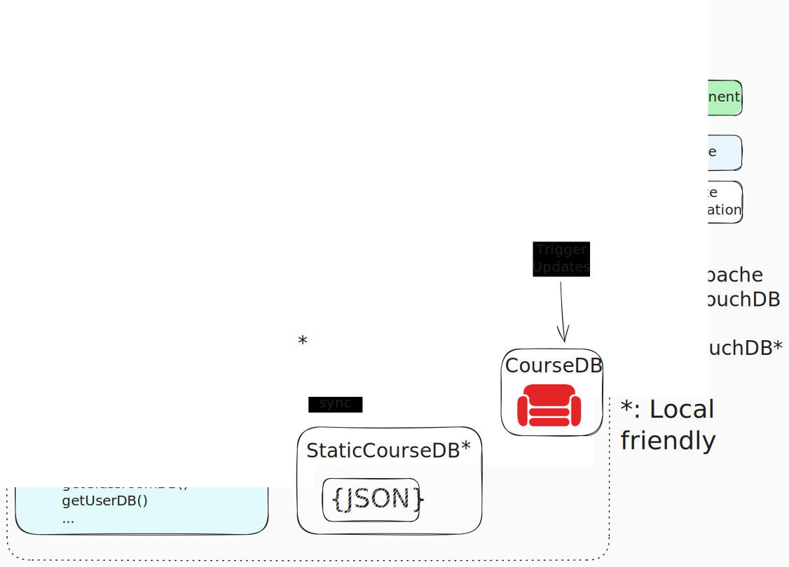
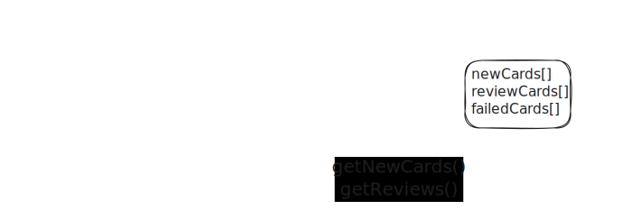

# The Big Picture



The focal point of `skuilder` is the main learning loop housed in the `StudySession.vue` component. If you ran the inline demo on the docs [frontpage](../index), you've encountered this loop first-hand. Here we will step through the lifecycle of a *Study Session* and describe the major components along the way.

::: warning !!!
This diagram is not *strictly* accurate in terms of named entities or functions, but is right in spirit.
:::

## Session Startup

### Configuration

Before the loop begins, a few objects are created to parameterise the session.
- a list of `StudyContentSource`s
- a time limit for the session
- some user config (eg: confetti preference)

In the frontpage demo, the `StudyContentSource` is hard-coded. In an application with a single standalone course, that course would be hardcoded. In more general contexts, the contentSources may come from a user's registrations or selections from a menu.

The `StudyContentSource` at this point is passed by reference - just an ID string.

### Initialization

`StudyContentSource` is a small interface:

<<< @../../packages/db/src/core/interfaces/contentSource.ts#docs_StudyContentSource

The behaviour of a course depends (in obvious ways!) on both the course content and the current user. To instantiate the working content souces, a helper from the `dataLayerProvider` is used, which combines each curriculum store with a user's running records to produce the personalized content source for the session:

``` ts
getStudySource(source: ContentSourceID, user: UserDBInterface): StudyContentSource
```

We're here:


### Session Planning & Data Hydration

With the content sources initialized, the `SessionController` now populates its queues for the session.


The default behaviour is to prefer surfacing at least *something* new for each session, but otherwise to make some tradeoff between how long the session is scheduled for and how much backlog review exists. Skuilder likes to keep a buffer of cards that are *eligible* for review but do not *immediately require* it, as a means of gracefully handling increases or decreases to a user's regular study routine.

In the definition of `StudyContentSource` above, two types

``` ts
type StudySessionReiewItem {}
type StudySessionNewItem {}
```

are described - each of which is a subtype of the more general

Like the ContentSource

With some `newCards` and `reviewCards` in the pipe,




## The Main Loop

As the user responds to each card, events are emitted for the SessionController to handle. (See the [authoring cards](./cards) doc for a live demo).


## Cleanup

As the session approaches its configured time limit,
