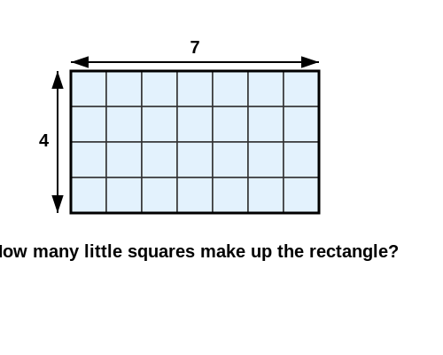

**Note 1:** This background info is not *required* unless you're intersted creating either customized cards, or customized pedagogical logic for you course. On first read, it may be suitable to skip ahead to the [Default Card Type](./cards) doc.

**Note 2:** See [Extend: Creating Custom Cards](../extend/custom-cards) for a more hands-on treatment of this info.


# Cards - The Unit of Study

**Cards are the atomic unit of learning content.** Each card represents a single pedagogical interaction - a question to answer, a passage to read, a skill to practice.

In particular, a single card is typically **the rendered thing** with which a user interacts.

In the database, a card is metadata that references its constituent parts:

```typescript
interface CardData {
  id_displayable_data: DocumentId[];  // One or more data instances
  id_view: DocumentId;                // The view component ID
  elo: CourseElo;                     // Difficulty rating
  author: string;
  // ... (course, tags, etc.)
}
```

## The Card Lifecycle

When a user encounters a card, the system performs **card hydration**:

1. **Fetch Data**: Retrieves the referenced `DisplayableData` documents from the database
2. **Convert Format**: Transforms database documents into `ViewData` (plain objects with typed field values)
3. **Instantiate Question**: Creates the appropriate `Question` subclass with the data
4. **Render View**: Displays the Vue component associated with this question type
5. **Capture Response**: Records user interaction (answer, time spent)
6. **Evaluate Performance**: Runs the question's `evaluate()` method
7. **Update Pedagogy**: Adjusts ELO ratings and schedules next review


# Core Components

## 1. **DataShapes** - Schema Definitions

A `DataShape` defines the structure of data that can populate a card:

```typescript
interface DataShape {
  name: DataShapeName;
  fields: FieldDefinition[];
}
```

Each field has a `name`, `type` (from the `FieldType` enum), and optional validators/taggers. Available field types include:
- Primitives: `STRING`, `NUMBER`, `INT`
- Content: `MARKDOWN`, `IMAGE`, `AUDIO`, `MIDI`
- Specialized: `CHESS_PUZZLE`, `MEDIA_UPLOADS`

**Example**: Single-digit addition
```typescript
{
  name: DataShapeName.MATH_SingleDigitAddition,
  fields: [
    { name: 'a', type: FieldType.INT },
    { name: 'b', type: FieldType.INT }
  ]
}
```

## 2. **Questions** - Strongly-Typed Pedagogy Layer

The abstract `Question` class (extends `Displayable`) defines how to:
1. **Interpret** data into an interactive experience
2. **Validate** user responses
3. **Evaluate** demonstrated skill

```typescript
abstract class Question {
  static dataShapes: DataShape[];
  static views: ViewComponent[];

  protected abstract isCorrect(answer: Answer): boolean;
  protected displayedSkill(answer: Answer, timeSpent: number): number;
  public evaluate(answer: Answer, timeSpent: number): Evaluation;
}
```

Questions declare:
- Which `DataShapes` they consume
- Which Vue components can render them
- How to assess correctness
- (Optionally) Custome performance metrics

**Example**: The `SingleDigitAdditionQuestion` consumes data matching `SingleDigitAdditionDataShape` and can render via `HorizontalAddition.vue` or `VerbalAddition.vue` components.

## 3. **Views** - The Presentation Layer

Vue components that receive:
- A `Question` instance (with populated data)
- Props/events for user interaction

In practice, a view is used to render a specific `Displayable` or `Question` type.

# Design Goals

## **Compositional Questions**

Questions can:
- **Inherit** from base implementations (override `isCorrect()`, reuse `displayedSkill()`)
- **Compose** multiple sub-questions into compound assessments

The architecture supports cards containing instances of several questions, enabling compound assessments where failure in subcomponents can be analyzed independently.

For example, the stacked addition question

<pre>
  123
+ 456
-----
</pre>

Can, at runtime, execute as a sequence of `SingleDigitAdditionQuestion` instances evaluated on their own merits, leading to...

## **Strongly Typed Pedagogy**

With compositional questions, aspects of prerequsite structure and inferred competence can be handled **by the 'compiler'** rather than hand-rolled by a curriculum author.

EG, the successful completion of the stacked addition question above can explicitly count as practice on the SingleDigitAddition skills as well, and mastery of the SingleDigitAddition can serve as prerequisite for the 3-digit addition.

## **Flexible Rendering**

A single `DataShape` can have multiple views:
- `SingleDigitAddition`::`HorizontalAddition.vue` (symbolic: "7 + 4 = ?")
- `SingleDigitAddition`::`VerbalAddition.vue` (natural language: "What is seven plus four?", "Seven and four make ___")

Different views of the same content
- provide more robust signal of competence
- avoids 'overfitting' developed skill to a specific presentation
- permits some types of explicit scaffolding

For example, a canned sequence of renderings of a basic multiplication fact can enforce the relationship between multiplication and the area of a rectangle.

The 'normal' view:

`4 x 7 = __`

Followed directly by:


