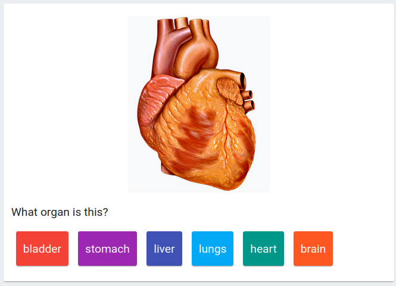

Skuilder's default card type uses **markdown** enhanced with a **moustache** syntax to define its interactivity. The features are described by example in the editors below. The editors are live - play with the contents.

**Note** that the rendering context here - outside of the assumed environment of a skuilder StudySession, with many cards rendered at once - may result in some slightly wonky behaviour.

## Information Cards

When no moustache syntax exists, the card is interpreted as a straightforward markdown document.

<EmbeddedFillInEditor :initial-value="infoCardExample" />

Dismissals of information cards are automatically stamped with `isCorrect: true`.

## Basic Fill-In Example

Simple fill-in-the-blank with a single correct answer. This renders a `TextInput` for the user to enter the answer. In normal context, it will autofocus the input element.

<EmbeddedFillInEditor initial-value="The capital of France is {{Paris}}." />

## Multiple Alternatives Example

Let's be little more forgiving. The below will accept either Paris or paris. Generally, moustache items separated by a `|` are siblings that play the same role in the rendered card.

<EmbeddedFillInEditor initial-value="The capital of France is {{Paris|paris}}." />

## Fill-In with Multiple Choice

Instead of a user-typed answer, we can render multiple choice

A __blank__ can present as a multiple choice question with correct answer and distractors:

<EmbeddedFillInEditor :initial-value="atmosphereExample" />

Here, the double-bar `||` separates the correct answer from distractors, and the single bar `|` separates distractors.

The order of rendered options is randomized, and a maximum of 6 options will be rendered, no matter the number of distractors supplied.

If an item exists as both an `answer` and a `distractor`, it will be interprted only as an answer.

Multiple correct answers can be supplied as well. Exactly one correct answer will be rendered as an option.

<EmbeddedFillInEditor initial-value="*Twinkle Twinkle Little Star* has the same melody as {{The Alphabet Song (ABC...) | Baa Baa Black Sheep || Stairway to Heaven }}."/>

## Multiple Choice as Answer-to-a-Question

If the multiple-choice moustache is the **final** content of the card, it will render the options but insert no blank into the text.

<EmbeddedFillInEditor initial-value="Is `skuilder` neat? {{ I guess so || not really }}"/>

## On Whitespace

Whitespace inside of moustache notation is trimmed, which can help to write readible card source. The following texts all render the same card:

Dense:
<pre class='whitespace-exmaple'>
{{whitespaceExamples[0]}}
</pre>

Spaced:
<pre class='whitespace-exmaple'>
{{whitespaceExamples[1]}}
</pre>

Roomy:
<pre class='whitespace-exmaple'>
{{whitespaceExamples[2]}}
</pre>

## Markdown in Answers

Rendered multiple-choice buttons may also include markdown.

<EmbeddedFillInEditor initial-value="Find the slanty one. {{*here*||here}}" />

Including, eg, code blocks:

<EmbeddedFillInEditor :initial-value="codeblockExample" />

## Media in Cards

Basic cards support media (audio, image) that has been bundled with the card. Porting that process to this docs site is a work in progress, but the rough picture is this:

## General Content Embedding

If it's markdown, it mostly just works. For example, this youtube embed.

Note: if you're reading this and haven't watched this talk, treat yourself.

<EmbeddedFillInEditor :initial-value="embeddingExample" />
