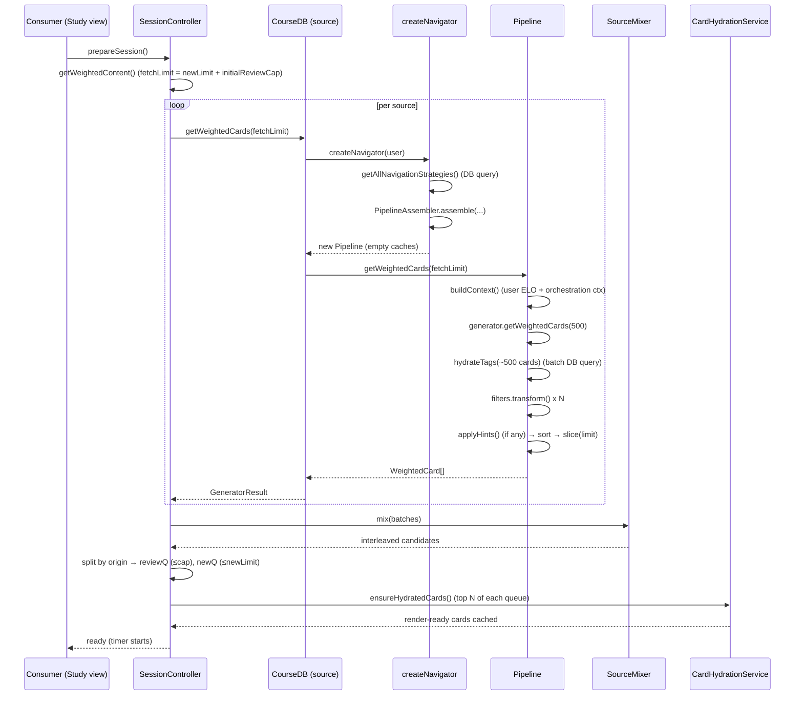
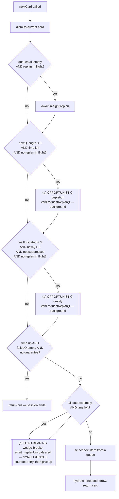
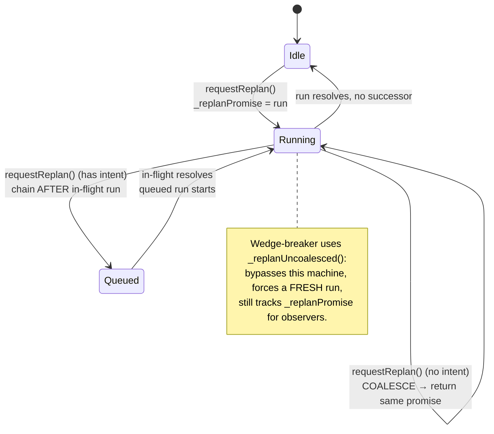

# Session Lifecycle & Replanning (as-built)

> **Status:** Descriptive map of current behavior, for theory-building and review.
> The core sections (Cast → Consumer extension points) are consumer-agnostic and
> framework-doc-ready. The final **Performance notes** section is living,
> internal/diagnostic commentary on the *current* implementation — it folds in
> the former `agent/session-pipeline-perf` assessment and should be trimmed
> before this ships as public framework documentation.
>
> **Perf work is parked (2026-05).** The felt mid-session jank (the synchronous
> wedge-breaker firing when the queue bottomed out) is resolved by the cache work
> recorded below. The `[perf]` timing instrumentation is commented out in place
> (search `[perf] parked` in the source); uncomment to re-measure. Remaining
> threads (cold spin-up, possibly-remote reads) are documented but not pursued.

This document maps how `SessionController` drives content selection through the
navigation `Pipeline` during a study session: what runs at session start, when
the pipeline re-runs ("replans"), how concurrent replans are reconciled, and
where consumer applications hook in.

It is a companion to `navigators-architecture.md` (which describes the
generator/filter pipeline itself). This doc describes the *driver* around it.

---

## Cast

| Component | Role | Layer |
|-----------|------|-------|
| `SessionController` | Owns the session clock + three queues; decides what card is next; triggers replans | framework |
| `StudyContentSource` | A content source. Production impl is `CourseDB` (one per course in the session) | framework |
| `CourseDB.getWeightedCards()` | Builds a navigator and runs it | framework |
| `CourseDB.createNavigator()` | Reads strategy docs, assembles a `Pipeline` | framework |
| `Pipeline` | generator → tag hydration → filters → hints → sort → top-N | framework |
| `SourceMixer` | Interleaves candidates from multiple sources | framework |
| `CardHydrationService` | Turns selected items into render-ready cards (view component + data) | framework |
| Consumer card views | May call `requestReplan()` with hints (e.g. pedagogical intros) | **consumer** |

The three queues live on `SessionController`:

- **reviewQ** — SRS-due cards. Filled once at start, drained by consumption, **never refilled** mid-session.
- **newQ** — new content. Refilled by replans.
- **failedQ** — cards failed this session, for end-of-session cleanup.

---

## Two distinct pipeline entry points

Everything expensive happens inside `Pipeline.getWeightedCards()`. It is reached
two ways:

1. **Initial planning** — `prepareSession()` → `getWeightedContent()` once.
2. **Replan** — `requestReplan()` → `_executeReplan()` → `getWeightedContent({replan:true})`, any number of times mid-session.

Both call `source.getWeightedCards(limit)` on every source. **There is no
separate "cheap" path** — a replan runs the same machinery as initial planning.

---

## Sequence: session start



Key parameters (`SessionController` constructor options):

- `defaultBatchLimit` (default **20**) — newQ target size.
- `initialReviewCap` (default **200**) — max reviews loaded at start.
- On init, `fetchLimit = defaultBatchLimit + initialReviewCap` (e.g. **220**) is
  passed to each source so reviews and new cards can both fill from one fetch.

---

## Sequence: serving a card (`nextCard`) and its replan triggers

`nextCard()` dismisses the current card, then runs **three** replan triggers
before drawing the next card. The framework comments classify them precisely:



### The trigger taxonomy (from the source comments)

- **(a) Opportunistic prefetch** — `depletion` (newQ ≤ `DEPLETION_PREFETCH_THRESHOLD` = 3)
  and `quality` (`_wellIndicatedRemaining` ≤ buffer). Fire-and-forget (`void`),
  may coalesce, may no-op. Their job is to make replans happen *early*. **A
  missed opportunistic replan is acceptable** — it's a perf optimization.
- **(b) Load-bearing wedge-breaker** — if the clock is ticking and we'd serve
  `null`, the pipeline runs **synchronously** in the draw path. Bypasses
  coalescing. This is the only *correctness* guarantee. **A missed wedge-breaker
  is a stall/wedge.**

> Design rule from the code: *"a redundant pipeline run is a perf bug, a missing
> pipeline run is a correctness bug. Bias toward the cheaper failure."*

The user-perceptible **in-session pause** is the wedge-breaker firing
synchronously — i.e. the opportunistic prefetch already lost the race to the
user emptying the queue.

---

## Replan lifecycle (concurrency state machine)

`requestReplan()` reconciles concurrent replans. The distinction that drives the
machine is **intent**: a bare auto-replan (no label/limit/hints/guarantee) has
no intent and may coalesce; anything carrying caller intent must not be dropped.



Has-intent test (`_replanHasIntent`): true if any of `label`, `limit`,
`minFollowUpCards`, non-`replace` `mode`, or non-empty `hints`.

### Side-effects a replan can set

| Flag / counter | Set by | Effect |
|----------------|--------|--------|
| `_suppressQualityReplan` | burst replan (`limit < defaultBatchLimit`) | mutes the (a)-quality trigger so a small hinted queue isn't clobbered before consumption; cleared by depletion trigger |
| `_minCardsGuarantee` | replan with `minFollowUpCards` | timer cannot end session until this many more cards served; lets an intro card surface near session end with guaranteed follow-up |
| `_wellIndicatedRemaining` | every plan/replan | count of cards scoring ≥ `WELL_INDICATED_SCORE` (0.10); drives (a)-quality |

### Auto-exclude on every replan

`_runReplan()` always excludes, via `hints.excludeCards`: the current card, every
card already in `_sessionRecord`, and `newQ.peek(0)` (the imminent draw). This
prevents the just-drawn / about-to-draw card from being re-seated at the head of
a freshly-replaced newQ and shown twice.

---

## Consumer extension points

This is where applications (e.g. LettersPractice) shape the session. The
framework surface is small:

1. **`SessionController.requestReplan(options)`** — request a mid-session replan.
   `ReplanOptions`: `hints`, `limit`, `mode` (`replace`|`merge`),
   `minFollowUpCards`, `label`.
2. **`ReplanHints`** (forwarded to the pipeline, applied *after* the filter
   chain, one-shot): `boostTags`, `boostCards`, `requireTags`, `requireCards`,
   `excludeTags`, `excludeCards`. Tag/card patterns support `*` globs.
3. **`source.setEphemeralHints()`** — how the controller threads hints to each
   source for the next run. `CourseDB` stashes them; `Pipeline` consumes and
   clears them after one run.

Hint application order in the pipeline (`applyHints`): **exclude → boost →
require**. `requireCards` is a hard guarantee — required cards are injected into
the result with `+Infinity` score even if a filter zeroed them, and are
pre-fetched into the pool if the generator never produced them.

### Worked example: LettersPractice GPC-intro (a "burst + follow-up" replan)

When a phonics intro card completes, the consumer view fires a replan that
*reshapes* the immediate future of the session:

```ts
// GpcIntroView.vue, on intro completion
emit('request-replan', {
  label: `gpc-intro-${letter}-complete`,
  hints: {
    boostTags:    { [exerciseTag]: 10.0 },   // push the matching exercise
    requireCards: [followUpCardId],           // guarantee the "who said that?" follow-up
    excludeTags:  ['gpc:intro:*'],            // don't surface another intro right now
  },
  limit: 3,            // BURST: tiny queue
  mode: 'replace',
  minFollowUpCards: 2, // guarantee 2 cards even if the timer is nearly up
});
```

This composes several framework mechanisms at once:

- `limit: 3` → burst replan → sets `_suppressQualityReplan` so the background
  quality trigger won't immediately clobber these 3 hinted cards.
- `requireCards` → the follow-up card is force-injected even if filters/ELO
  wouldn't have ranked it.
- `minFollowUpCards: 2` → sets `_minCardsGuarantee`, so the intro's practice
  actually gets shown rather than the session ending on the intro.
- `excludeTags: ['gpc:intro:*']` → prevents back-to-back intros.

It is submitted *before* the intro animation plays out ("submit + replan early
so the planner works while the words play") — an explicit attempt to hide
pipeline latency behind animation time.

### Best practices for consumers

- **Submit and replan _early_, behind cover.** Fire `requestReplan()` as soon as
  intent is known (e.g. on card submit, before an animation finishes) so the
  pipeline runs during otherwise-idle time. The GPC-intro example does this
  deliberately — the planner is latency-bound, so give it slack.
- **Treat opportunistic replans as best-effort.** A missed `(a)` prefetch is a
  perf hiccup, not a bug. Never encode correctness ("this card _must_ appear") in
  a bare auto-replan — it can be silently coalesced. Carry **intent** (`label`,
  `limit`, `hints`, `minFollowUpCards`) so the request is preserved.
- **Use `requireCards` for hard guarantees, not `boostTags`.** Boosts only bias
  ranking; `requireCards` force-injects with `+Infinity` even past a zeroing
  filter, and pre-fetches the card if the generator never produced it.
- **Guard end-of-session intros with `minFollowUpCards`.** A late intro card
  without a follow-up guarantee can end the session on the intro itself.
- **Small `limit` shrinks the queue, not the work.** A `limit: 3` burst still
  fetches ~500 candidates and runs every filter (see the fetchLimit note below).
  Use bursts to _shape_ the near-future queue, not as a speed optimization — and
  note a burst sets `_suppressQualityReplan`, so it temporarily mutes the
  quality trigger.
- **Don't replan per keystroke/answer.** Replans coalesce but aren't free; lean
  on the controller's built-in depletion/quality triggers for routine refills.

---

## Performance notes (living — internal/diagnostic; trim for public framework doc)

> Folds in the former `session-pipeline-perf` living assessment. Observations
> about the *current* implementation; diagnostic, not part of the stable design.
> Snapshot: 2026-05.

### Resolved: the felt mid-session jank

The reported symptom was UX jank — pauses once the session queues bottomed out.
Root cause: the **synchronous wedge-breaker** (see the `nextCard` trigger
taxonomy) firing in the draw path because the *background* replan lost the
consumption race. The opportunistic prefetch couldn't keep ahead because every
pipeline run was cold (caches defeated, hotspot below). Three changes closed it:

| Fix | Commit | Effect |
|-----|--------|--------|
| ELO-pool session cache in `getCardsCenteredAtELO` (fetch the broad neighbor pool once, re-rank in memory against the live ELO) | `b43dec1d` | recenter **2621ms -> 14ms** |
| Cache the constructed navigator (`_getCachedNavigator`) so the `Pipeline` instance — and its `_tagCache` / `_cachedOrchestration` — persist across replans | `1a0b1e0b` | retires "every run is cold" |
| Score from the pooled `c.elo`; delete the redundant `getCardEloData()` 500-doc `allDocs` | `e79bf619` | ~330ms off every ELOgen |

These shortened the warm replan (~2.6s) enough that it wins the race against
consumption. Observed sessions now report `wedgeRuns=0 awaitedReplan=false`. The
wedge path stays as the correctness backstop, but is rare-to-absent under normal
pace.

> **Caveat — not fully proven.** This is confirmed by jank-free logs, but we have
> not yet captured a *normal-pace* session with `wedgeRuns>0` to study the
> remaining trigger (or confirm it never fires). Don't re-optimize the wedge path
> on the assumption it's still hot; do capture such a log before declaring it
> closed for good.

### The two clocks (a mental model worth keeping)

Latency is only *felt* in proportion to whether the user waits on it. Every stage
sits on one of two clocks:

- **Blocking clock — felt 1:1.** User is staring at the screen with nothing to do.
  Cold first plan / spin-up, first-card hydrate, and the wedge-breaker *when it
  fires*.
- **Race clock — felt only past a budget.** Runs ahead of the user; absolute
  latency is invisible until it exceeds its slack. Background replan (deep slack
  ~ 3-card depletion lead), background hydration (thin slack), already-hydrated
  `nextCard` draws (trivial).

| Stage | Cost | Clock | Slack | How felt |
|-------|------|-------|-------|----------|
| Cold spin-up (ELO reindex ~2.5s of it) | ~4.6s | **Blocking** | none | **1:1, maximal** |
| Background hydration | 1-2s/card | Race | thin | at the margin |
| Background replan | ~2.6s | Race | deep (~3 cards) | rarely felt |

The cache work above optimized the *least* time-sensitive stage (background
replan) — correctly, since that is what keeps us out of the wedge. The *most*
time-sensitive stage (cold spin-up, dominated by the ELO view reindex) is
essentially untouched.

### Open / parked threads (running notes)

- **Cold spin-up (~4.6s, blocking)** dominated by the first `elo` view reindex
  (`getCardsByELO below~2490ms`). Most time-sensitive, least touched. A cheap
  micro-fix worth trying: fire a throwaway `db.query('elo', {limit:1})` early
  (e.g. on the study-hub view) to keep the IndexedDB index warm before
  `/study/practice`.
- **Reads may be hitting REMOTE CouchDB, not the local replica** — the leading
  hypothesis for the remaining costs (see next subsection). If true, this is one
  root cause behind spin-up + per-card hydration + `regDoc`, not three.
- **Per-card hydration `cardDoc+tags` = 0.8-2.1s each**, a persistent band (not
  just at startup). Entirely `getCourseDoc` + `getAppliedTagsBatch`. On a *local*
  PouchDB these should be tens of ms — hence the remote-reads suspicion.
- **`getPendingReviews` ~ 768ms**, recomputed fresh on every replan (SRSgen).
  Candidate to incrementalize, but reviews mutate as cards are answered, so
  correctness needs care.
- **`regDoc ~ 444ms`** — a single registration-doc read inside
  `getCardsCenteredAtELO`. Same "reads may be remote" smell.

### The likely root cause: reads may not be local

`CourseDB` picks local-vs-remote **once, at construction**: `this.db = localDB ??
remoteDB`, where `localDB` is non-null only if `CourseSyncService` sync state is
exactly `'ready'` at that instant. Miss that window (cold first visit:
replication + view-warming takes seconds) and the whole session's pipeline reads
go to the remote handle and **never re-bind** after sync finishes.

The "remote" CouchDB in dev is `localhost:5984`, so the cost is *not* network
latency — it is **per-request work the CouchDB server does**: MapReduce view-index
maintenance. The log fingerprints it: the same `elo` view queried back-to-back
reads `below=2490ms` then `above=111ms` — cold reindex then warm, not latency
(which would tax both equally). What invalidates the index? *This session's own
ELO writes* — every answered card writes a card-ELO doc, bumping `update_seq`. A
local sync replica is one-shot, read-only and pre-warmed, so local reads never
trigger a reindex.

To confirm: add a one-line `CourseDB` constructor log (`db=local|remote`); split
the hydration timer into `cardDoc` (`.get`, no view) vs `tags`
(`getAppliedTagsBatch`, a view query) — if `tags` carries the 1-2s it's the
reindex story. The fix is then *not* micro-optimizing reads but guaranteeing the
session runs against a ready local replica (await `'ready'`; re-bind or
lazy-resolve `this.db`; reuse hydration handles).

### Still-true structural notes

1. **Every pipeline run *was* cold (RESOLVED by `1a0b1e0b`).** `getWeightedCards`
   used to call `createNavigator(user)` per invocation, building a new `Pipeline`
   with empty `_cachedOrchestration` / `_tagCache` every time. The cached
   navigator now preserves both across replans within a session.
2. **`fetchLimit` is hardcoded to 500 regardless of `limit`.**
   `Pipeline.getWeightedCards(limit)` always pulls ~500 candidates, hydrates
   their tags, and runs every filter over all 500, slicing to `limit` only at the
   end. A `limit: 3` burst does the same heavy work as a full plan.
3. **Initial fetch is inflated to ~220** (`defaultBatchLimit + initialReviewCap`),
   compounding (2) at spin-up.

### Instrumentation (parked)

The `[perf]` timing logs across `Pipeline`, `SessionController`,
`CardHydrationService`, `elo`/`srs` generators, and `courseDB` are commented out
in place — search **`[perf] parked`**. Uncomment to re-measure. The pre-existing
`[Pipeline:timing]` summary line is kept (it predates this effort). Two
provenance fields added during the dig — `awaitedReplan` and `wedgeRuns` on the
`nextCard` log — are the instruments to re-enable first if the wedge question is
revisited.

## File reference

| File | Relevant region |
|------|-----------------|
| `db/src/study/SessionController.ts` | queues, `requestReplan`, `_runReplan`, `nextCard` triggers, wedge-breaker |
| `db/src/impl/couch/courseDB.ts` | `getWeightedCards`, `setEphemeralHints`, `createNavigator` (no cache) |
| `db/src/core/navigators/Pipeline.ts` | `getWeightedCards` (fetchLimit=500), `applyHints`, `hydrateTags`, `buildContext` |
| `db/src/core/navigators/generators/types.ts` | `ReplanHints`, `GeneratorResult` |
| `db/src/study/SourceMixer.ts` | `QuotaRoundRobinMixer` |
| `db/src/study/services/CardHydrationService.ts` | render-ready card cache |
| `db/src/study/SessionDebugger.ts` | per-draw / per-replan queue snapshots |
| consumer: `letterspractice/src/questions/GpcIntroView.vue` | burst + follow-up replan example |
| consumer: `letterspractice/src/services/lessons.ts` | `getPostLessonHints()` |
